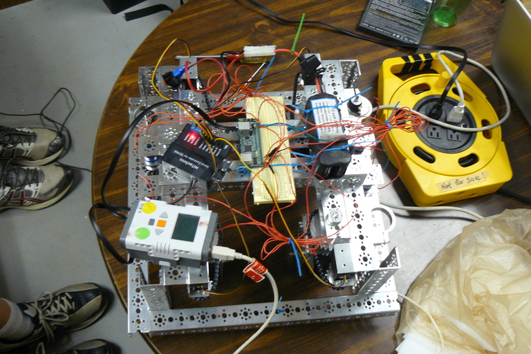
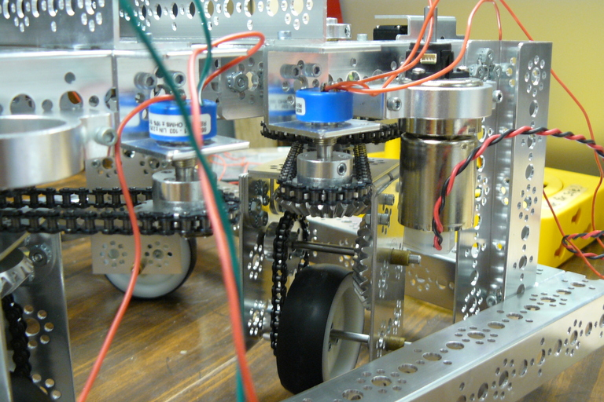
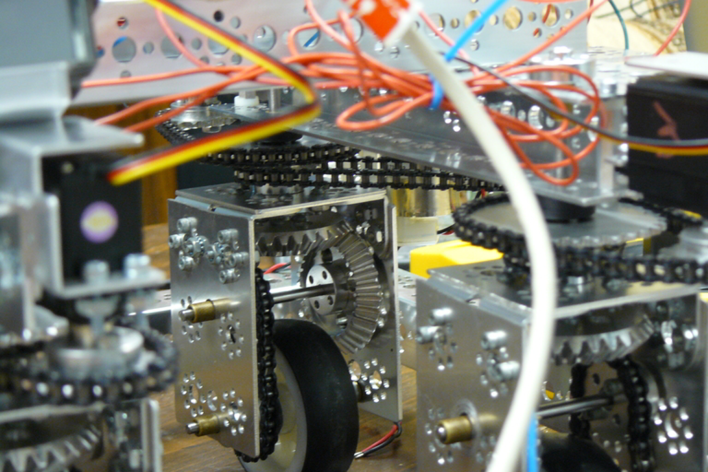

### Meeting Goals:
* Reduce frame size 
* Finish V3 swerve drive
 

### Frame 
Our robot frame was within 18X18 inches, but it was too close to the maximum dimensions for us to add the layer of black plastic we wanted to use as a decoration and as a protective shield. We cut down the frame bars, and rebuilt the robot's outer frame with a 1" clearance on the sides.

### V3 Swerve
The newest iteration of LordSwerve has a 1 to 1 ratio from the modules to the potentiometers, to address the earlier issue with reading accurate measurements for the module rotation. We finished most of the design, but were lacking 4 of the sprockets we need in order to complete the newest prototype.

