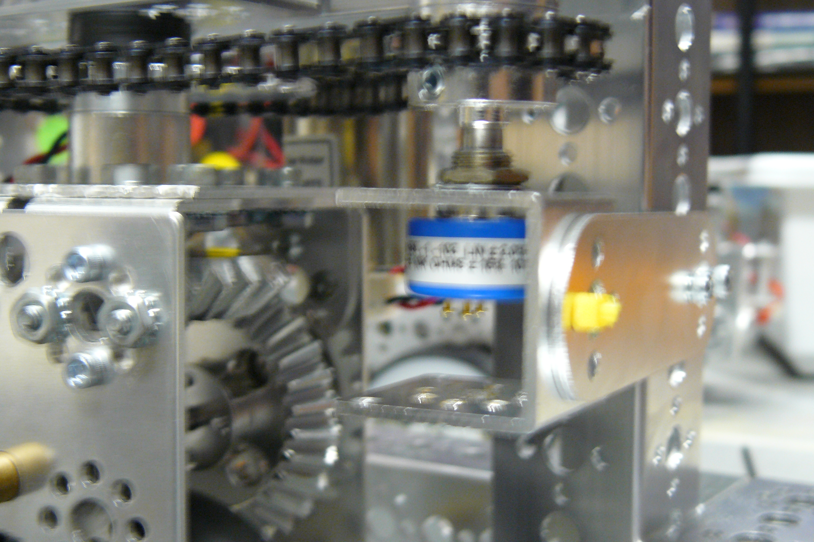
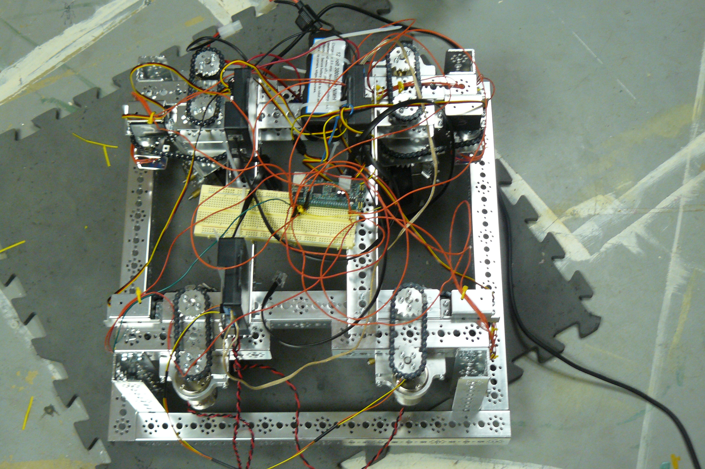

###Meeting Goals:
* Increase gear ratio on swerve modules
* Mount Potentiometers to frame

###Swerve Module Contstruction
Today we increased the gear ratio on the servos that rotate the swerve modules. Previously, the ratio had been 1-1.5, giving us 64 in-oz of torque. The new 
ratio is 1-2, giving us 82 in-oz. This was done to give us a little bit of extra margin, ensuring that the servos can handle the load.
###Potentiometer Mount
We created a mount to securely hold the potentiometers in place, and link them to the servos. Working out a method for catching rollover in the code has allowed us
to mount to the servos, instead of the modules.

At the end of the day, we completed construction on the modules, and wired and mounted the potentiometers
