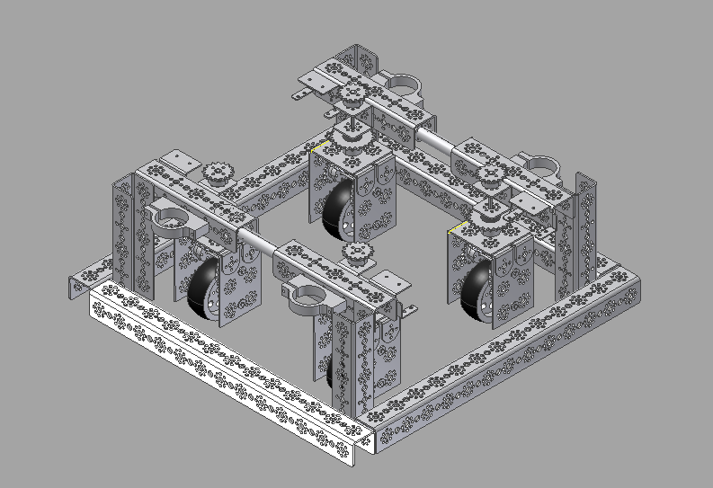

### Meeting Goals:
* Build additional modules (If parts come)
* Work on Inventor model of drivetrain
* Decide what type of potentiometer to buy

### CAD Model of drivetrain

### Potentiometer:
Here is a list of the possible options that we considered:

* USDigital MA3 - Magnetic absolute encoder, infinite rotation, little to no deadband at rollover point - $40
* 10 turn potentiometer - limited rotation to 10 rotations, absolute - $14
* Infinite turn potentiometer - infinite rotation, absolute within 1 turn - $14

We decided that an infinite turn potentiometer is best for our usage and budget. Ideally, we would use a USDigital MA3, but we felt that the MA3 is overkill for our usage.

Here is the specific one we picked: [Bourns 6639S-1-103](http://www.digikey.com/product-search/en?x=0&y=0&lang=en&site=us&KeyWords=6639S-1-103-ND+)