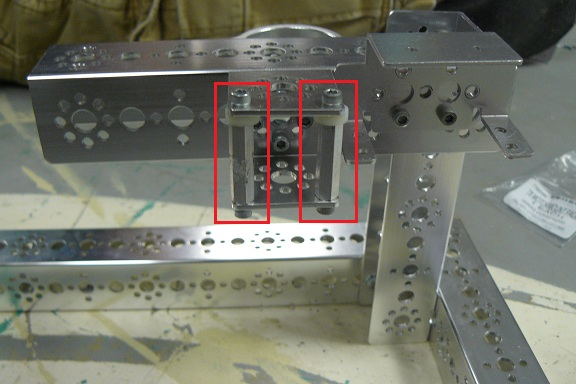
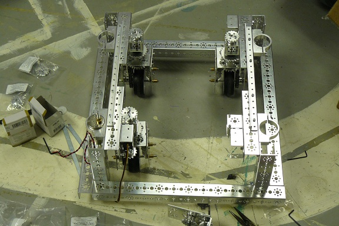

###Meeting Goals:
* Build more modules for the swerve drive prototype
* Discuss and decide on what potentiometer will be used on the swerve drive prototype

###Swerve Module Contstruction
Today we focused on building more swerve modules to attach to our frame. We redesigned and strengthened the module that we had already built by adding 
more bolts to it. Using the information regarding a mechanical weakness in our swerve module(See July 6, 2012), we created a brace around the axle so that it would
not bend under the stress of being hit by another robot, or flex under under sideways stresses.
###Below is a picture of the brace we created. The added braces are outlined by red rectangles

At the end of the day, we completed construction on three swerve modules and nearly finished our final module.
